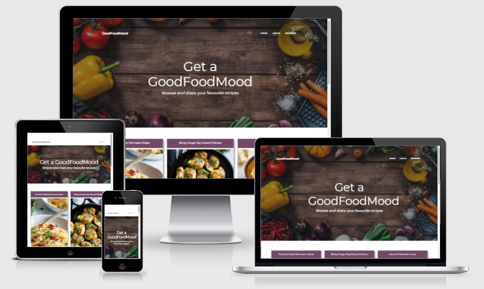
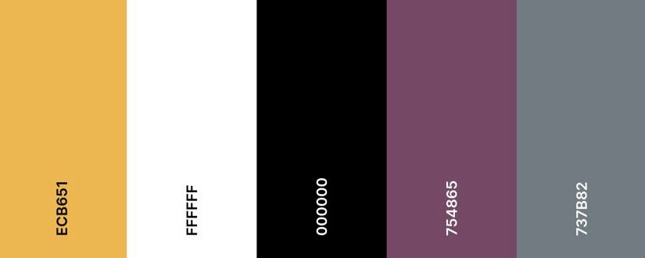
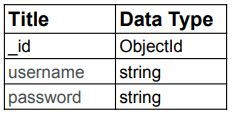
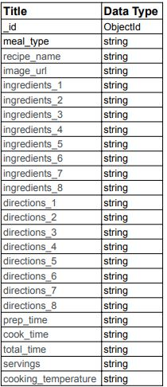

[View GoodFoodMood website here](https://good-food-mood.herokuapp.com/)

# GoodFoodMood


## The goal of this website is to share cooking recipes that will be populated by both the owner and registered users that appear on tiles on the main page. Each user has their own profile page where they can store, edit or delete their uploaded recipes.

### User Experience (UX)

#### The user goals will be to:
* Easily navigate through the website
* Ability to access the website using multiple devices
* Create an account to store created recipes
* Create recipes
* Update recipes
* Delete created recipes

### User Stories

#### As a user, I want - 
* the navigation bar clearly visible so I can easily navigate the website.
* a page displaying all uploaded recipes.
* the website responsive across devices so I can swap and change devices as I wish.
* the page laid out neatly so that I can find information effortlessly.
* to create a profile that will be home to all my recipes and allow me to create then replace, update and delete recipes that i have uploaded to the website.

### Site owner goals

#### As the site owner, I want - 
* to provide a simple navigation display making it easy for users to navigate through the website.
* to display all recipes on the home page.
* to provide responsiveness across all device screen sizes.
* to lay out all recipe information as clearly as possibly so users can find everything with ease.
* to allow users to create profiles, giving them access to create, replace, update and delete recipes.

### Design

#### Colour Scheme
 - I researched multiple recipe websites to check their colour schemes and ended up with the colours below. The colours used across the website are Purple which is said to invoke creativity, Yellow that invokes happiness with Grey for borders/shading and classic Black and White being used for font colour.

    

#### Typography
 - The font used across the website is Monserrat because of it's simplicity and legibility with Sans Serif as the fall back font.

#### Imagery
 - The only image used for the website is on the index.html page. It contains food items around the parimeter of the image and fits in with the recipe website theme. The rest of the recipe images are uploaded by the user/admin via a link and these are retrieved from Mongodb database.

#### Wireframes

* [Home wireframe](#)

* [Login wireframe](#)

* [Register wireframe](#)

* [Profile wireframe](#)

* [Add Recipe wireframe](#)

### Existing Features
 * The website is made up of 5 x pages. 2 of which are only visible to a user when they create a profile.
 * #### Home page
   * The Home page is made up of a brand logo and navigation bar along the top of the page. The navbar scrolls with the user to help them keep on track. The navigation bar changes to a hamburger button on smaller screens.
   * A background image appears below the navbar with a welcome message overlay in the centre.
   * Recipes are retrieved from MongoDB and displayed in a card view showing the user an overview of the recipe name, image and description. A button can then be clicked to view the full recipe.
   * Social media icons for Twitter, Facebook and Instagram appear in the footer.
 * #### Login page
   * A form is displayed over the main background image with inputs for a user to enter their username and password.
   * A button then checks that the username and password exists within the MongoDB database and returns a flash message.
   * Once successful the user will have access to their profile page and an the Add Recipe button.
 * #### Register page
   * A form is displayed over the main background image with inputs for a user to enter their username,password and a field to verify their entered password.
   * A button then adds the username and password to the MongoDB database if successful and returns a flash message above the form.
   * The user will then have access to their profile page and an the Add Recipe button.
 * #### Profile page
   * A welcome "username" message appears over the main background image.
   * The users uploaded recipes are retrieved from MongoDB and displayed in cards.
   * The cards house 2 x buttons for editing and deleting the users recipes and both activate modal pop ups.
   * The editing modal display's a form showing all the data the user previously input allowing them to make edits or additions where requiredwith a button along the bottom to submit the changes to MongoDB.
   * The delete modal displays a warning to users to confirm that their intention is to delete with a button on the bottom which deletes the recipe from MongoDB.
 * #### Add Recipe page
   * The add recipe page contains an user instruction and button to activate a form modal.
   * The add recipe form modal displays provides a user with labels and fields to enter their recipe. The add recipe button at eh end of the form submits the recipe to MongoDB that will in tirn be displayed on the homepage and on their profile.

### Features for future implimentation
 * Different sections for meal types
 * Search function
 * Remove imported css to improve page loading speed.
 * A more dynamic relational database to avoid so many if statements for inputs.

# Information Architecture
## users data
|

## recipes data


## Technology Used

### Languages used
* [HTML5](https://en.wikipedia.org/wiki/HTML5)
* [CSS3](https://en.wikipedia.org/wiki/CSS)
* [Javascript](https://en.wikipedia.org/wiki/JavaScript)
* [Python](https://www.python.org/)

### Frameworks/Libraries and Programs used
1.  [Balsamiq](https://balsamiq.com/)
    - Balsamic was used to build wireframes for the website pages.
2.  [Font Awesome](https://fontawesome.com/)
    - Font awesome was used for the social media icons in the footer and the icons on the login/registration forms.
3.  [Google fonts](https://fonts.google.com/)
    - The Monserrat font that i used across the website was taken from Google fonts.
4.  [Istockphoto](https://www.istockphoto.com/)
    - Istockphoto was used for all the main background website image.
5.  [TinyJPG](https://tinyjpg.com/)
    - Tinyjpg was used to reduce the size of all the background image.
6.  [Befunky photo editor](https://www.befunky.com/)
    - Befunky photo editor was used to resize images.
7.  [Bootstrap](https://getbootstrap.com/)
    - Bootstrap was used for the recipe cards and to make the website more responsive in certain areas.
8.  [Coolers](https://coolors.co/)
    - Coolers was used to help generate a colour palette for the entire site.
9.  [MongoDB](https://www.mongodb.com/)
    - MongoDB holds the Recipes database that holds the recipe data and user credentials.
10. [Flask](https://flask.palletsprojects.com/en/2.0.x/)
    - Flask framework was used to build the website. 
11. [Werkzeug](https://werkzeug.palletsprojects.com/en/2.0.x/utils/#module-werkzeug.security)
    - Werkzeug was user to generate hashed passwords.
12. [Favicon](https://favicon.io/)
    - Favicon.io was used to create the website favicon.
13. [MDB Bootstrap](https://mdbootstrap.com/docs/standard/)
    - MDB bootstrap was used to create the modals.
14. [Start Bootstrap](https://startbootstrap.com/)
    - Start Bootstrap was used to create the structure of the website using the Clean Blog theme.
15. [Web Formatter](https://webformatter.com/)
    - Web Formatter was used to format the CSS stylesheet and all HTML pages to make the code easier to read.
16. [Gitpod](https://gitpod.io/)
    - Gitpod was used to write the website code.
17. [GitHub](https://github.com/)
    - GitHub was used to host the code and website contents.

## Testing

* [Jigsaw CSS validator](https://jigsaw.w3.org/css-validator/) - Custom CSS test validated and passed
* [W3C Markup validator](https://validator.w3.org/) - HTML test validated and passed
* [JSHint](https://jshint.com/) - Javascript test validated and passed
* [PEP8](http://pep8online.com/) - Python test validated and passed

### Testing user Stories
-   #### User Goals
1. Easily navigate through the website
    * The navigation bar at the top of the screen is responsive and is clearly laid out for the user.
2. Ability to access the website using multiple devices
    * The website is responsive across all screen sizes.
3. Create an account to store created recipes
    * The profile page allows the user to view all their uploaded recipes.
4. Create recipes
    * Once registered the user has access via the navbar to add a recipe.
5. Update recipes
    * The user can update/edit their uploaded recipes from their profile page.
6. Delete created recipes
    * The user can delete their uploaded recipes from their profile page.

-   #### User Stories
    ##### As a user, I want - 
1. the navigation bar clearly visible so I can easily navigate the website.
    * The navbar is clearly visible at the top of each screen
2. a page displaying all uploaded recipes.
    * The Homepage displays all uploaded recipes from all users.
3. the website responsive across devices so I can swap and change devices as I wish.
    * The website is responsive across all device screen sizes.
4. the page laid out neatly so that I can find information effortlessly.
    * Everything on the website is clearly labelled making it easy for users to navigate.
5. to create a profile that will be home to all my recipes and allow me to create then replace, update and delete recipes that i have uploaded to the website.
    * Each user profile page gives the user access to their uploaded recipes with option to edit/delete their existing uploaded recipes and an add recipe button on the navbar allowing them to upload recipes.

-   #### Site Owner Goals
    ##### As the site owner, I want - 
1. to provide a simple navigation display making it easy for users to navigate through the website.
    * Navigation throughout the website is simple and straight forward.
2. to display all recipes on the home page.
    * All recipes displayed on the home page.
3. to provide responsiveness across all device screen sizes.
    * Website responsive on all devices.
4. to lay out all recipe information as clearly as possibly so users can find everything with ease.
    * The website is easily navigated.
5. to allow users to create profiles, giving them access to create, update and delete recipes.
    * Users are able to create,update and delete recipes once they're registered.

### Further Testing
 * The website was tested on Chrome, Safari and Firefox with no issues found.
 * Google Dev tools were used in the creation of the website and to ensure each page was responsive across all device screen sizes.
 * Google dev lighthouse was used to test the performance/ accessibility/ best practice and SEO and all return a high score.

### Issues
 * The Start Bootstrap template imported was causing styling issues.
    - The only solution i had was to use "!important" within CSS to rectify.
 * The first modal created wouldn't link correctly and open the correct recipe information.
    - The solution was to create and dynamic id to only show the selected recipe.

### Unresolved Issues
  * The social media icons on hover won't change color on hover. I believe this is because of some imported style.

## Deployment

If you want to run this project locally within your own IDE please follow the instructions below:

The below must be installed:

* PIP
* Python 3.7 (or newer version)
* Git
* A [mongodb](https://www.mongodb.com/) account

### Instructions

1. Download a clone of the GitHub [repository](https://github.com/tony-reddington/goodfoodmood) then select download Zip

2. Open a terminal session in the unzip folder or cd to move to the correct location.

3. A virtual environment is suggested for the Python interpreter, I suggest using Pythons built in virtual environment. Type the command line:
```
python -m venv <dir to install to e.g. .venv>
```  
Be Aware that your Python command may differ bepython3 or py

4. Activate the .venv by typing the command line:
```
.venv\Scripts\activate 
```
This command line may vary depending on your operating system, please check the [Python Documentation](https://docs.python.org/3/library/venv.html) for further guidance.

4. Ensure pip is the latest version by typing the command line below:
```
pip install --upgrade pip.
```

5. Install the neccesary modules by typing the command line below:
```
Pip install -r requirements.txt.
```

6. Within your local IDE you must create a file named `.flaskenv`.

7. Within the .flaskenv file, you must create a SECRET_KEY variable and a MONGO_URI to link to your own database. Please make sure to call your database `goodfoodmood`, with 2 collections named `users` and `recipes`. 

8. If using VSCode you must create a folder named .vscode and a file named settings.json inside then add the below:

```
 "terminal.integrated.env.windows": {
    "SECRET_KEY": "",
    "DEV": "1",
    "HOSTNAME": "0.0.0.0",
    "PORT": "5000",
    "MONGO_URI": "[Database uri here]",
  }
```

9. You may now run the application with the command line:
```
python app.py
```

## Heroku Deployment

To deploy your website to Heroku, you should follow the instructions set out below:

1. Create a requirements.txt file with the command line:
```
pip3 freeze –local > requirements.txt
```
2. You now need to create a Procfile by typing the command line:
```
echo web: python app.py > Procfile
```
3. One the Procfile has been created you access the file and delete the empty line at the bottom and save the file to avoid any issues.
3. Proceed to the [Heroku](https://id.heroku.com/login) website where you should log in and click "New" then "Create new app" and then proceed to selecting the closest region to you.
4. Proceed to the "Deploy" at the top, then to "Deploy method". Once found,  select the github button. Link to GitHub by entering your website repo name and clicking search and connect.
5. Click "Setting" on the top navbar and scroll to "Config Vars" then click the "Reveal Config Vars" button.
6. Copy the key and value pairs from your IDE env file and enter into the fields provided and click "Add".
7. Proceed back to your terminal and add and commit the requirements.txt file and push to GitHub.
8. Once these steps are completed, go back to Heroku and click "Deploy" and scroll down to "Automatic deploys" then proceed and click "Enable Automatic Deploys"
9. You should then recieve a message stating that your app has been succesfully deployed.

## Credits

### Code
* Start Bootstrap was use for the website structure.
* MD Bootstrap was used for creating the Modals
* Bootstrap was used for creating the cards and for responsiveness across different size devices. 
* W3 Schools & Stack overflow were used to help find tips and solutions.

### Content
* All text throughout the website was written by the developer and recipe data extracted partially from recipe websites.

### Media
* The main background image was downloaded from [Istock](https://www.istockphoto.com/) with credit to fcafotodigital.
* Recipe image links from recipe pages with credit to https://kirbiecravings.com, https://wellnourished.com.au, https://images.squarespace-cdn.com, https://www.budgetbytes.com, https://images.immediate.co.uk and https://pickyeaterblog.com
### Acknowledgements
* My mentor Richard Wells for his guidance, expertise and support.
* My Husband, Family and friends for testing the website across multiple devices.